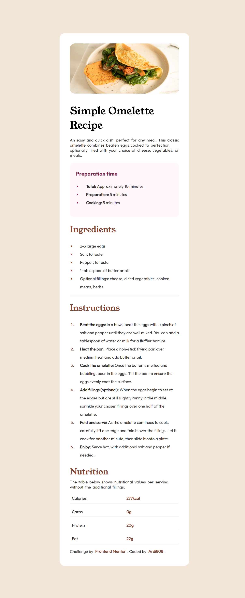
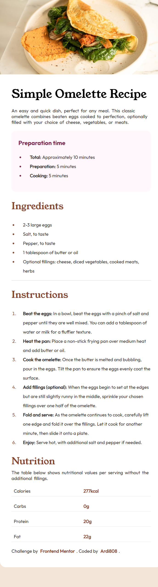

# Frontend Mentor - Recipe page solution

This is a solution to the [Recipe page challenge on Frontend Mentor](https://www.frontendmentor.io/challenges/recipe-page-KiTsR8QQKm).  
Frontend Mentor challenges help you improve your coding skills by building realistic projects. 

## Table of contents

- [Overview](#overview)
  - [Screenshot](#screenshot)
  - [Links](#links)
- [My process](#my-process)
  - [Built with](#built-with)
  - [What I learned](#what-i-learned)
  - [Continued development](#continued-development)
- [Author](#author)

## Overview

### Screenshot

**Desktop view**

**Mobile view**

**Screenshot solution**
  

### Links

- Solution URL: (https://www.frontendmentor.io/solutions/recipe-page-using-html5-css-flex-and-css-grid-sjGmb-LwRE)
- Live Site URL: (https://ardi808.github.io/recipe-page-main/)

## My process

### Built with

- Semantic HTML5 markup
- CSS custom properties
- Flexbox
- CSS Grid
- Mobile-first workflow
- `@font-face` custom fonts

### What I learned

Through this challenge I learned how to:

- Use **CSS custom properties** for consistent color and theme management.
- Apply **@font-face** to load and use custom fonts locally.
- Structure semantic HTML with sections for preparation, ingredients, instructions, and nutrition.
- Combine **Flexbox** (for centering) and **Grid** (for nutrition table) effectively.
- Create a **responsive design** using a mobile-first workflow and media queries.

### Continued development

For future projects, I want to:

- Improve accessibility (ARIA labels, better alt text for images).
- Explore more responsive typography with clamp().
- Add subtle animations or transitions to make the UI more interactive.

## Author

- GitHub - Ardi808
- Frontend Mentor - @Ardi808